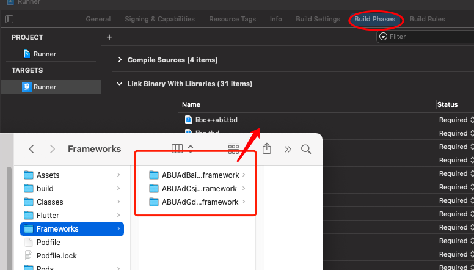
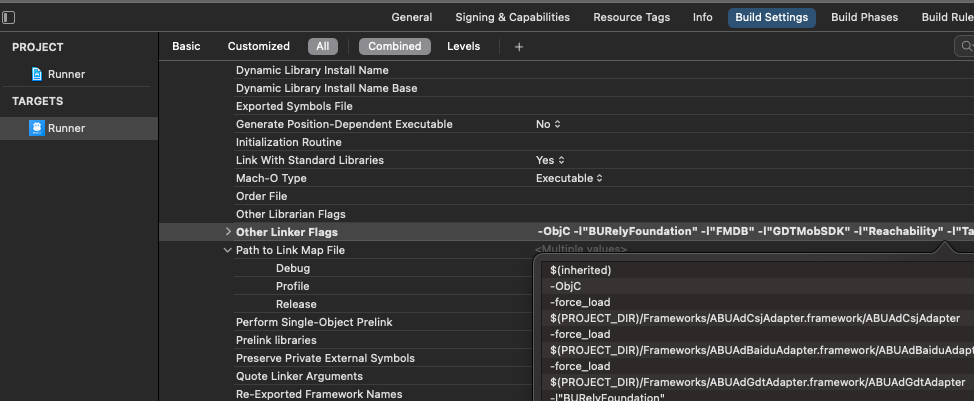

# Flutter版穿山甲Gromore广告插件

> 新增激活鸟广告插件 ： [传送门](https://github.com/nxe-team/flutter_jihuoniao)

## 特点

- 使用kotlin和swift语言开发
- 提供了较为完整的广告配置和回调事件
- 开屏广告支持配置logo及自定义渲染

## 支持平台

- ✅ 安卓
- ✅ iOS

## 支持功能

- ✅ 开屏广告
- ✅ 插屏广告
- ✅ 信息流广告
- 🔲 Banner广告
- 🔲 激励广告

## 接入文档

### 三方SDK导入

> 具体内容请参考官方SDK接入文档

#### Android

1. 把使用到的广告商SDK和Adapter的导入进来，示例中添加了广点通、穿山甲和百度。

```gradle
// 百度SDK通过aar方式引入，需要放在android/app/libs目录下
repositories {
    flatDir {
        dirs 'libs'
    }
}

dependencies {
    implementation "com.gromore.cn:gdt-adapter:4.462.1332.0"   //gdt adapter
    implementation 'com.qq.e.union:union:4.462.1332'// 广点通广告 SDK
    implementation "com.gromore.cn:pangle-adapter:4.4.0.9.0" //穿山甲 adapter
    implementation 'com.pangle.cn:ads-sdk-pro:4.4.0.9' //穿山甲广告 SDK
    implementation "com.gromore.cn:baidu-adapter:9.21.1" //百度 adapter
    implementation(name:'Baidu_MobAds_SDK-release_v9.213',ext:'aar') //百度 SDK
}
```

2. AndroidManifest.xml中手动添加对应adn的配置项（权限相关配置在授权部分介绍）

```xml
<!-- Pangle start================== -->
<provider
   android:name="com.bytedance.sdk.openadsdk.TTFileProvider"
   android:authorities="${applicationId}.TTFileProvider"
   android:exported="false"
   android:grantUriPermissions="true">
   <meta-data
       android:name="android.support.FILE_PROVIDER_PATHS"
       android:resource="@xml/pangle_file_paths" />
</provider>

<provider
   android:name="com.bytedance.sdk.openadsdk.multipro.TTMultiProvider"
   android:authorities="${applicationId}.TTMultiProvider"
   android:exported="false" />
<!-- Pangle end================== -->

<!-- GDT start================== -->
<!-- targetSDKVersion >= 24时才需要添加这个provider。provider的authorities属性的值为${applicationId}.fileprovider，请开发者根据自己的${applicationId}来设置这个值，例如本例中applicationId为"com.qq.e.union.demo"。 -->
<provider
   android:name="com.qq.e.comm.GDTFileProvider"
   android:authorities="${applicationId}.gdt.fileprovider"
   android:exported="false"
   android:grantUriPermissions="true">
   <meta-data
       android:name="android.support.FILE_PROVIDER_PATHS"
       android:resource="@xml/gdt_file_path" />
</provider>

<activity
   android:name="com.qq.e.ads.PortraitADActivity"
   android:configChanges="keyboard|keyboardHidden|orientation|screenSize"
   android:screenOrientation="portrait" />
<activity
   android:name="com.qq.e.ads.LandscapeADActivity"
   android:configChanges="keyboard|keyboardHidden|orientation|screenSize"
   tools:replace="android:screenOrientation"
   android:screenOrientation="landscape" />

<!-- 声明SDK所需要的组件 -->
<service
   android:name="com.qq.e.comm.DownloadService"
   android:exported="false" />
<!-- 请开发者注意字母的大小写，ADActivity，而不是AdActivity -->

<activity
   android:name="com.qq.e.ads.ADActivity"
   android:configChanges="keyboard|keyboardHidden|orientation|screenSize" />
<!-- GDT end================== -->

<!-- baidu start================== -->
<!-- 声明打开落地页的Activity（不建议修改主题配置）-->
<activity
   android:name="com.baidu.mobads.sdk.api.AppActivity"
   android:configChanges="screenSize|keyboard|keyboardHidden|orientation"
   android:theme="@android:style/Theme.NoTitleBar"/>
<!-- 声明打开显示激励视频/全屏视频的Activity-->
<activity
   android:name="com.baidu.mobads.sdk.api.MobRewardVideoActivity"
   android:configChanges="screenSize|orientation|keyboardHidden"
   android:launchMode="singleTask"
   android:theme="@android:style/Theme.Translucent.NoTitleBar" />

<!-- 如果targetSdkVersion设置值>=24，则强烈建议添加以下provider，否则会影响app变现 -->
<!-- android:authorities="${packageName}.bd.provider" authorities中${packageName}部分必须替换成app自己的包名 -->
<!-- 原来的FileProvider在新版本中改为BdFileProvider,继承自v4的FileProvider,需要在应用内引用support-v4包 -->
<provider
   android:name="com.baidu.mobads.sdk.api.BdFileProvider"
   android:authorities="${applicationId}.bd.provider"
   android:exported="false"
   android:grantUriPermissions="true">
   <meta-data
       android:name="android.support.FILE_PROVIDER_PATHS"
       android:resource="@xml/bd_file_paths" />
</provider>
<!-- baidu end================== -->
```

3. 代码混淆及资源混淆配置
4. 插件内部已经引入gromore SDK，所以无需再次引入（implementation "com.gromore.cn:gromore-sdk:3.4.0.3"）。其他内容均以官方为准。

#### iOS

> 插件已经引入 GroMore 3.4.0.4 和穿山甲 SDK 4.3.0.5

1. 引入广告的基础 SDK，案例中使用 CocoaPods 引入百度和广点通，可见 `example/ios/Podfile` 。引入时需要注意 Adapter 所支持的 SDK 版本范围，可在 GroMore 接入文档查看。
2. 引入 GroMore 提供的广告 Adapter，按需引入即可，案例中引入百度和广点通。在下载的 `GroMore_iOS_V3.4.0.5` 文件中将需要的 Adapter 复制到项目 `ios/Frameworks` 下，然后链接到 `Build Phases -> Link Binary With Libraries` ，如图：

   
3. 对 Adapter 插件库配置 `-force_load` 项目，可见 [穿山甲 GroMore Xcode 编译配置](https://www.csjplatform.com/union/media/union/download/detail?id=108&docId=618372f59e41cf0042bc001b&osType=ios) ，请以穿山甲文档为准。

   
4. 建议允许 `http` 访问，`info.plist` 添加：

   ```plist
   <key>NSAppTransportSecurity</key>
   <dict>
       <key>NSAllowsArbitraryLoads</key>
       <true/>
   </dict>
   ```

### 授权

1. 请求非必要权限（仅Android）

同时请求：READ_PHONE_STATE, COARSE_LOCATION, FINE_LOCATION, WRITE_EXTERNAL_STORAGE权限

```dart
FlutterGromore.requestPermissionIfNecessary();
```

修改AndroidManifest配置（注：插件内部已经添加了必要权限，如下所示，可选权限参考官方文档）

```xml
<!-- 必要权限，插件内部已经添加，不需要再次添加 -->
<uses-permission android:name="android.permission.INTERNET" />
<uses-permission android:name="android.permission.ACCESS_NETWORK_STATE" />
<uses-permission android:name="android.permission.WRITE_EXTERNAL_STORAGE" />
<uses-permission android:name="android.permission.READ_EXTERNAL_STORAGE" />
<uses-permission android:name="android.permission.REQUEST_INSTALL_PACKAGES" />
<uses-permission android:name="android.permission.READ_PHONE_STATE" />

<!--必要权限，解决安全风险漏洞，发送和注册广播事件需要调用带有传递权限的接口-->
<permission
    android:name="${applicationId}.openadsdk.permission.TT_PANGOLIN"
    android:protectionLevel="signature" />
<uses-permission android:name="${applicationId}.openadsdk.permission.TT_PANGOLIN" />


<!--可选权限，视情况添加，参考官方文档-->
```

2. ATT授权（仅iOS）

从iOS 14开始，只有在获得用户明确许可的前提下，应用才可以访问用户的IDFA数据并向用户投放定向广告。在应用程序调用 App Tracking Transparency 框架向最终用户提出应用程序跟踪授权请求之前，IDFA将不可用。如果某个应用未提出此请求，则读取到的IDFA将返回全为0的字符串，这个可能会导致广告收入降低。

```dart
FlutterGromore.requestATT();
```

在 info.plist中添加描述

```
<key>NSUserTrackingUsageDescription</key> 
<string>ATT权限使用说明，需要开发者自行设置描述</string>
```

> 可配置 `SKAdNetwork` ，让 iOS 14 以上版本 IDFA 不可用时进行归因，参考 [穿山甲 GroMore iOS14 适配说明](https://www.csjplatform.com/union/media/union/download/detail?id=108&docId=618373011352b00048decd33&osType=ios) 。

### 初始化SDK

在用户授权后调用

```dart
FlutterGromore.initSDK(
    appId: "",
    appName: "",
    debug: true);
```

### 开屏广告

1. 说明

- 开屏广告提供了两种方式：第一种是自渲染（仅Android端可用，不建议使用），第二种是拉起原生页面
- 自渲染方式以Widget的方式提供
- 原生页面方式支持传入logo，渲染时logo会在底部显示（logo值不需要文件后缀）

2. 使用

```dart
// 拉起开屏页（会等待广告关闭或广告渲染失败）
await FlutterGromore.showSplashAd(
  config: GromoreSplashConfig(
    adUnitId: GoMoreAdConfig.splashId, logo: "launch_image"),
  callback: GromoreSplashCallback(onAdShow: () {
    print("callback --- onAdShow");
}));

// 自渲染（由于iOS端SDK未提供相关支持，因此仅适用于安卓）
child: GromoreSplashView(
  creationParams: GromoreSplashConfig(
    adUnitId: GoMoreAdConfig.splashId, height: height - 80),
  callback: GromoreSplashCallback(
    onAdEnd: () {
      Navigator.pop(context);
    }
),),
```

3. 参数（GromoreSplashConfig）

| 参数名       | 说明                                                         | 可选 |
| ------------ | ------------------------------------------------------------ | ---- |
| adUnitId     | 聚合开屏广告位id                                             | 是   |
| width        | 广告宽度（自定义渲染可用）                                   | 否   |
| height       | 广告高度（自定义渲染可用）                                   | 否   |
| logo         | 如果传入了logo则会在底部显示logo，logo放在android/app/src/main/res/mipmap下，值不需要文件后缀（非自定义渲染可用）。不传则全屏显示。 | 否   |
| muted        | 静音，默认为true                                             | 否   |
| preload      | 预加载，默认为true                                           | 否   |
| volume       | 声音配置，与muted配合使用                                    | 否   |
| timeout      | 超时时间，默认3，单位：秒(s)                                 | 否   |
| buttonType   | 按钮样式（1：全屏可点击，2：仅按钮可点击，默认为1）          | 否   |
| downloadType | 点击下载样式（0或者1，默认为1）                              | 否   |

4. 回调（GromoreSplashCallback，命名和 **Android** 聚合文档基本一致）

**新增了一个 onAdEnd 事件，建议统一在这个事件中处理广告销毁的逻辑**

| 回调方法名            | 说明                                                         |
| --------------------- | ------------------------------------------------------------ |
| onAdClicked           | 广告被点击，肯定有回调                                       |
| onAdShow              | Splash广告的展示回调,如果是优量汇（GDT）的广告 ,对应的是优量汇的onADExposure（）回调 |
| onAdShowFail          | show失败回调。如果show时发现无可用广告（比如广告过期），会触发该回调。开发者应该在该回调里进行重新请求。 |
| onAdSkip              | 点击跳过时回调                                               |
| onAdDismiss           | 广告播放时间结束时调用。 此时一般需要跳过开屏的 Activity，进入应用内容页面 |
| onSplashAdLoadFail    | 开屏广告加载失败                                             |
| onSplashAdLoadSuccess | 开屏广告加载成功，此时会展示广告                             |
| onAdLoadTimeout       | 开屏广告加载超时                                             |
| onAdEnd               | 开屏广告结束，这个时候会销毁广告（点击跳过、倒计时结束或渲染错误等 理应隐藏广告 的情况都会触发此回调，建议统一在此回调处理路由跳转等逻辑） |

### 插全屏广告

1. 说明

- 该广告类型支持插屏、全屏混出（穿山甲插屏/全屏代码位已无法新建，都使用GroMore【插全屏】广告位代替）
- 先加载广告id，成功后再渲染展示

2. 使用

```dart
// 加载全屏广告
interstitialId = await FlutterGromore.loadInterstitialAd(
    GromoreInterstitialConfig(
        adUnitId: GroMoreAdConfig.interstitialId,
        size: GromoreAdSize.withPercent(
            MediaQuery.of(context).size.width * 2 / 3, 2 / 3)));
if (interstitialId.isEmpty) {
    print("加载全屏广告失败");
}

// 合适的时机展示插屏广告
if (interstitialId.isNotEmpty) {
    await FlutterGromore.showInterstitialAd(
        interstitialId: interstitialId,
        callback: GromoreInterstitialCallback(onInterstitialShow: () {
            print("===== showInterstitialAd success ======");
        }, onInterstitialClosed: () {
            FlutterGromore.removeInterstitialAd(interstitialId);
            interstitialId = "";
            loadInterstitialAd();
        }));
}
```

3. 配置（GromoreInterstitialConfig）

| 参数名   | 说明                        | 必填 |
| -------- | --------------------------- | ---- |
| adUnitId | 插屏广告位id                | 是   |
| size     | 广告尺寸（GromoreAdSize类） | 是   |

4. 回调（GromoreSplashCallback，命名和 **Android** 聚合文档基本一致）

| 回调方法名             | 说明                                                         | 备注                                                         |
| ---------------------- | ------------------------------------------------------------ | ------------------------------------------------------------ |
| onInterstitialShow     | 广告展示                                                     |                                                              |
| onInterstitialShowFail | 如果show时发现无可用广告（比如广告过期或者isReady=false），会触发该回调。 开发者应该在该回调里进行重新请求。 | iOS端广告渲染失败时(interstitialAdViewRenderFail)也会走此回调 |
| onInterstitialAdClick  | 广告被点击                                                   |                                                              |
| onInterstitialClosed   | 广告关闭                                                     |                                                              |
| onAdOpened             | 当广告打开浮层时调用，如打开内置浏览器、内容展示浮层，一般发生在点击之后,常常在onAdLeftApplication之前调用，并非百分百回调，优量汇sdk支持，穿山甲SDK、baidu SDK、mintegral SDK、admob sdk暂时不支持 |                                                              |
| onAdLeftApplication    | 此方法会在用户点击打开其他应用（例如 Google Play）时于 onAdOpened() 之后调用，从而在后台运行当前应用。并非百分百回调，优量汇sdk和admob sdk支持，穿山甲SDK、baidu SDK、mintegral SDK暂时不支持 | 仅Android端可用                                              |

### 信息流广告

1. 说明

- 先加载广告id，成功后再渲染展示
- 渲染成功回调中(onRenderSuccess)提供了一个参数，表示渲染后的广告高度，可以用来动态控制组件显示与否
- 具体使用参考example

2. 使用

```dart

// 加载信息流广告
List<String> idList = await FlutterGromore.loadFeedAd(GromoreFeedConfig(adUnitId: GroMoreAdConfig.feedId));
if (idList.isNotEmpty) {
    String id = idList.removeLast();
    feedAdIdList.addAll(idList);
    return id;
} else {
    // 加载信息流广告失败
}

// 展示信息流广告
GromoreFeedView(
  creationParams: {
      "feedId": _feedAdId!
  },
  callback: GromoreFeedCallback(
    onRenderSuccess: (double height) {
      print("GromoreFeedView | onRenderSuccess | $height");
      setState(() {
        _height = height;
      });
    },
    onSelected: () {
      setState(() {
        _show = false;
      });
    }
))
```

3. 配置（GromoreFeedConfig）

| 参数名      | 说明                                                 | 必填 |
| ----------- | ---------------------------------------------------- | ---- |
| adUnitId    | 信息流广告位id                                       | 是   |
| count       | 请求数量，默认为3                                    | 否   |
| width       | 宽度，默认宽度占满                                   | 否   |
| height      | 高度，默认为0，0为高度选择自适应参数，模板信息流不填 | 否   |
| adStyleType | 1-模板信息流,2-原生信息流，默认为1                   | 否   |

4. 回调（GromoreFeedCallback，命名和 **Android** 聚合文档基本一致）

| 回调方法名      | 说明               | 备注                                         |
| --------------- | ------------------ | -------------------------------------------- |
| onAdClick       | 信息流广告点击     |                                              |
| onAdShow        | 信息流广告展示     |                                              |
| onRenderFail    | 模板渲染失败       |                                              |
| onRenderSuccess | 模板渲染成功       | 此回调有一个参数：height，表示广告渲染后高度 |
| onSelected      | 用户选择不喜欢原因 |                                              |
| onCancel        | 取消选择不喜欢原因 | 仅Android可用                                |
| onRefuse        | 拒绝填写原因       | 仅Android可用                                |
| onShow          | 拒绝弹框显示       | 仅Android可用                                |

## 问题

1. iOS端的开屏广告只能使用`FlutterGromore.showSplashAd`进行，如果在此时同时加载插屏广告，可能会导致插屏广告出现在开屏广告上方

使用`await`保证`FlutterGromore.showSplashAd`方法结束后再调用插屏广告的展示方法。

2. 穿山甲信息流广告使用 `WebView` 实现，在 iOS 上存在触摸穿透的问题。插件中对穿山甲广告做了触摸事件拦截，可见 [FlutterGromoreIntercptPenetrateView.swift](https://github.com/50431040/flutter_gromore/blob/main/ios/Classes/view/FlutterGromoreIntercptPenetrateView.swift) ，有任何问题请提 [issue](https://github.com/50431040/flutter_gromore/issues)。

   > Flutter 社区有相关讨论：[flutter#58659](https://github.com/flutter/flutter/issues/58659) 、[flutter#89956](https://github.com/flutter/flutter/issues/89956) 、[flutter#35784-comment](https://github.com/flutter/flutter/issues/35784#issuecomment-516243057) 等

3. iOS 信息流广告卡顿掉帧问题。穿山甲广告 `WebView` 在每次滑入可视区域时都会申请展示广告，在列表滚动时有卡顿，已尝试优化；掉帧问题可跟踪社区：[flutter#107486](https://github.com/flutter/flutter/issues/107486) 、[flutter#103014-comment](https://github.com/flutter/flutter/issues/103014#issuecomment-1118341729)、[flutter#101776](https://github.com/flutter/flutter/issues/101776) 。

其他问题请提[issue](https://github.com/50431040/flutter_gromore/issues)

## 团队

> 牛小二招聘前端

牛小二招聘是一款致力为国内物流蓝领提供靠谱的求职招聘服务平台，全网累计拥有数百万会员用户，每日实时更新司机、押运员、搬卸工、快递员招工及牛人信息，司机招聘与技术牛人涵盖挂车、叉车司机、客车司机、铲车司机、罐车司机、拖车司机及货运车司机等，求职者和雇主可挑选匹配沟通，提高人岗匹配率，降低沟通成本
